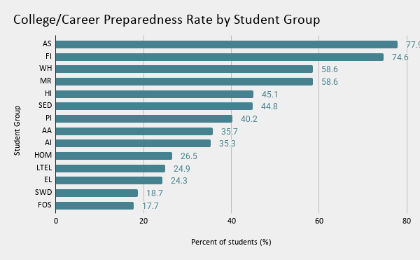
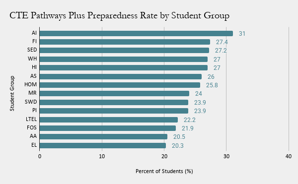

# California's Hands-On Education Gap 
Hands-on education is often described as the primary way to bridge the scholarly experience to the real-world skills by providing a plethora of tools. In California high schools, the most tool-providing form of education we provide is Career Technical Education, or CTE. 
CTE pathways aim to help students connect classroom lectures to careers, technical skills, and future college or workforce opportunities. 

This Project aims to observe and analyze California's College/Career Indicator dataset to ask:
**Are California students being prepared for their future college careers and occupations through hands-on learning equally across student groups?**

## Data Source
This project uses the California Department of Education's College/Career Indicator data. This dataset includes information about whether high school students are considered prepared for college or careers, based on several measures including, (and mainly), the completion of Career Technical Education pathways.

For this project, I focused on state-level records, by filtering the dataset to 'rtype = x.' I decided to compare student groups using two measures
1. Overall college or career preparedness rate
2. CTE pathway-plus preparedness rate

## Student Group Code Key

The charts use California's Department of Education student group codes, so I've created a chart to make deciphering the code easy on the eyes. 

| Code | Student Group|
|---|---|
| AA | Black or African American |
| AI | American Indian or Alaska Native |
| AS | Asian |
| EL | English Learner|
| FI | Filipino |
| FOS | Foster Youth |
| HI | Hispanic or Latino |
| LTEL | Long-Term English Learner |
| MR | Two or More Races |
| PI | Native Hawaiian or Pacific Islander |
| SED | Socioeconomically Disadvantaged |
| SWD | Students with Disabilities |
| WH | White |

## Chart 1: College/Career Preparedness by Student Group

**Caption**: College and career preparedness rates varies by student groups. This chart shows that there is 59.6 percent gap on student groups (Asian students at 77.3%) that are more likely to be counted as prepared for college or career than those at the bottom of the chart (Foster Youth at 17.7%).

## Chart 2: CTE Pathway-Plus Preparedness by Student Group

**Caption:** CTE pathway-plus preparedness is a measurable form of hands-on education in California's accountability system. An apparent difference with the first chart highlights the limitations of CTE pathways by failing to illustrate what kinds of courses students are taking within CTE as well as how they are performing. Inadequacy can be seen in the rough translation from Chart 2: CTE Pathways, to Chart 1: Career/College Readiness. For example, in Chart 2, Asian students, Filipino students, and socioeconomically disadvantaged students remain at the 3 highest percentages to complete CTE pathways with a grade of C- or better. While going back to observing Chart 1, the rank at which socioeconomic disadvantaged students stand on is not as clearly omitted, they fall to the sixth peg while Asian and Filipino students consistently rank first and second. Which can only allude to the circumstantial disadvantages that we are not able to see only through pure data. 

## Methods

I downloaded the College/Career Indicator dataset and analzsed it in Google Sheets. I filtered the data to state-level records using 'rtype = X' so the analysis would focus on California overall, rather than individual schools or districts. 
Then I created two pivot tables. The first illustrating the average overall college/career preparedness rates by student group. The second picturing the compared average CTE pathway-plus preparedness rates by student group. I sorted both pivot tables in descending order and removed "ALL" categories to defer arbitrary data. 

## What the Data Fails to Show

The data can show the differences in college/career preparedness, and CTE pathway-plus across all registered student groups. It can even help identify where gaps appear in California's education accountability data. Yet, the data lacks the ability to fully explain these differences and why gaps like these persist. It cannot show us wheher students had equal access to CTE courses, counselors, adequate resources, transportation, work-based learning, or capstone courses. It also fails to illustrate whether students showed an interest in enrolling in CTE but were unable to due to scheduling, funding, or even inadequate grading thresholds that keep students from over and underperforming. 

## Ethical Concerns

Ethical concerns may consist of a risk of blaming students or the families of students for lower preparedness rates without the specifics. These numbers should not be interpreted as individual failures. Differences across student groups may reflect unequal access to scholarly resources, career pathways, counseling, transportation (as stated above), stable housing, disability support, as well as English learner services. A more complete analysis and illustration of the possible resources accessible by students and staff is needed to determine how these resources play their part in students' lives, which would allow for a deeper and more sincere analysis of the educational system. This would mean interviewing students, teachers, counselors, CTE coordinators, and education policy experts.

## Conclusion 

Hands-on education is an important part of California's college and career readiness system. However, this data suggests that preparedness is not equal across student groups. CTE pathways may offer students valuable career-connected learning, but the key to avoid this perpetual layover of generational disparities is to target policy and pay attention to how and what students are benefiting most, why they benefit the most, and not forgetting those that need support, following the how's and why's!! 

- Google Sheets Analysis: [My Google Sheet](https://docs.google.com/spreadsheets/d/1o7HCRQHzQM-9FALLs237yu3-2e7tR1gAYpClMB2mYqM/edit?usp=sharing)
- College/Career Indicator Dataset: [CA Gov Datasets](https://www.cde.ca.gov/ta/ac/cm/ccidatafiles.asp)
- Download the dataset I used! (2024-2025): [24-25 Dataset](https://www3.cde.ca.gov/researchfiles/cadashboard/ccidownload2025.xlsx) 

